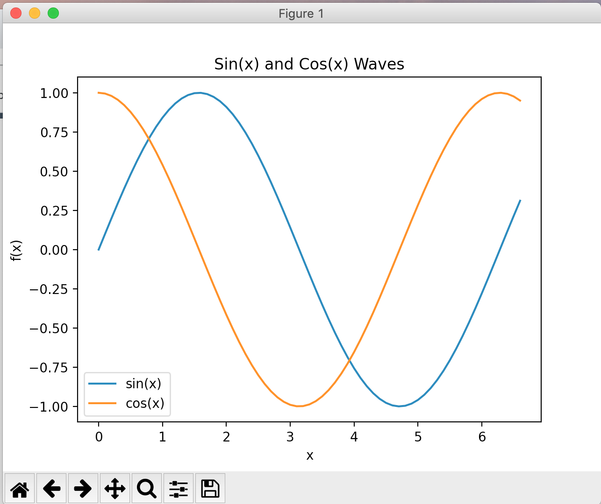

# 2020-06-17 Homework
* Modify your plot.py file, make sin(x), cos(x) on same chart with title, x, y label and legend. Your chart may look like 

* Refer to you rollDice.py program, create a game with two player compete each other by rolling 3 dice, add the value up, who ever has greater number wins. You can ask player put down the bit money each time, record the money for each player. Every end of the round, ask player if they want play more, till they say no, display total money for both player.