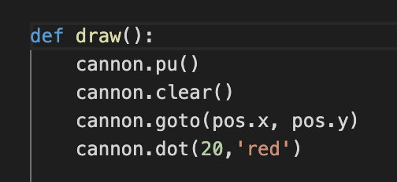

# 06-04-2020 Miranda Lu
Turtle is used for drawing and making games
## How to use turtle module
type: from turtle import *
(star means everything)

## How to define variable
* import module,
```python
from turtle import *
```
* define variable,
```py
a = 5
```
define function,
call function, 
run code ,
if you get an error message about "missing module" do this in terminal:
pip3 install

## How to define function

use def command in front of the function name.
indent on the next line.
theres always a colon after function name and parenthensis.

## Using function
type function name and parenthensis: 
EXAMPLE: draw()

## running code in terminal
1. right click
2. click "run python file in terminal"