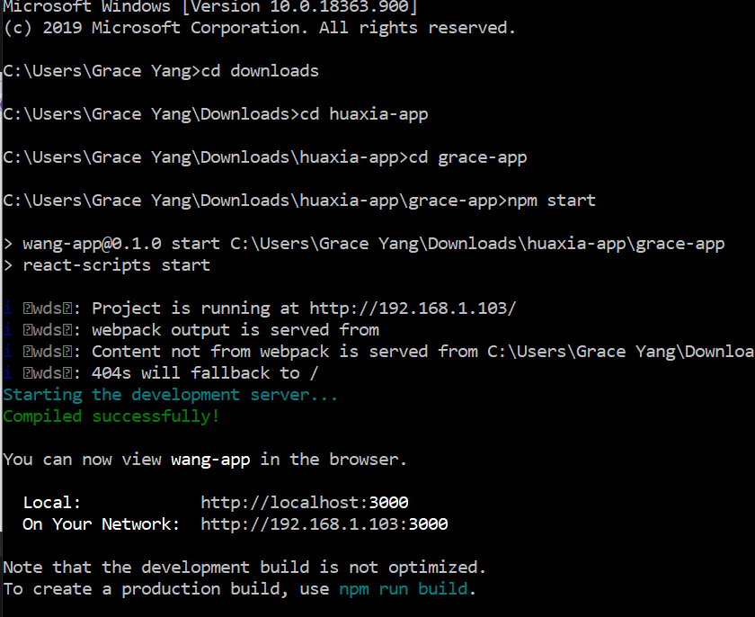

# 6/25/2020 Notes 

## Download Node 
* use this link: https://nodejs.org/en/download/
* check installation by writing **npm --version** in the terminal

## Install React 
* type **npm install -g create-react-app** in the terminal
* then type **create-react-app grace-app** in the terminal 

## Extract files from the google drive 

## Run App4.py
* run app4 
* click the link in the terminal 
* in url add **/books** and all the books should show up

## How to run the react server 

